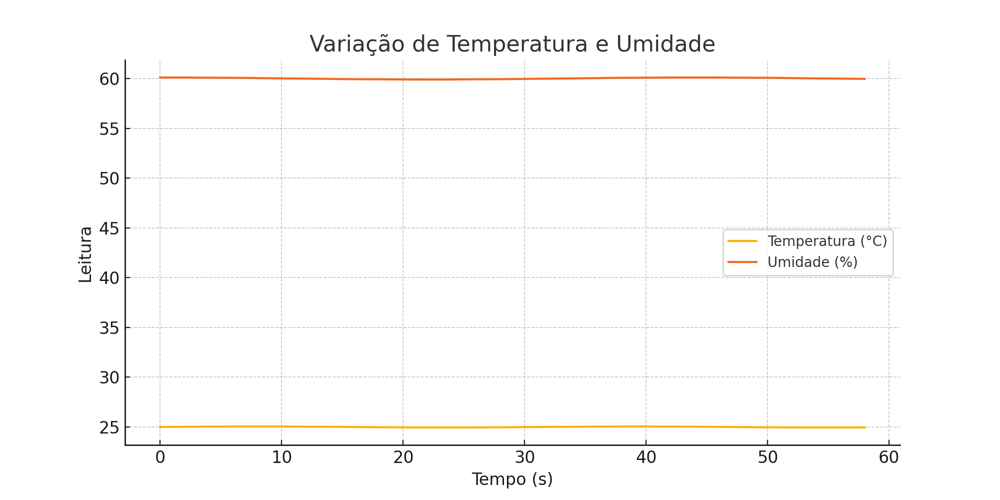

# Challenge Hermes Reply – Sprint 2

## 🌐 Contexto

Este projeto simula um sistema de coleta de dados em ambiente industrial utilizando o microcontrolador ESP32 e um sensor de temperatura e umidade (DHT22). O objetivo é representar a coleta e análise de dados como em ambientes reais da Indústria 4.0, permitindo decisões baseadas em dados para manutenção preditiva e eficiência operacional.

## ⚙️ Componentes Utilizados

- ESP32 Dev Module
- Sensor DHT22 (Temperatura e Umidade)

## 💡 Justificativa da Escolha do Sensor

O sensor DHT22 foi escolhido por oferecer medições precisas de temperatura e umidade, parâmetros críticos em ambientes industriais. Sua fácil integração com o ESP32 e ampla documentação também contribuíram para a escolha.

## 🔌 Esquema do Circuito

> Imagem da simulação disponível no arquivo `circuito.png`.

## 🧠 Código-Fonte

```cpp
#include "DHTesp.h"

const int DHT_PIN = 15; // Pino ligado ao sensor DHT22
DHTesp dhtSensor;

void setup() {
  Serial.begin(115200); // Inicializa comunicação serial
  dhtSensor.setup(DHT_PIN, DHTesp::DHT22); // Configura o tipo de sensor
}

void loop() {
  TempAndHumidity data = dhtSensor.getTempAndHumidity(); // Lê os dados

  Serial.println("Temperatura: " + String(data.temperature, 2) + "°C");
  Serial.println("Umidade: " + String(data.humidity, 1) + "%");
  Serial.println("---");

  delay(2000); // Aguarda 2 segundos para nova leitura
}
```

## 🧪 Coleta e Registro dos Dados

Os dados foram coletados via Monitor Serial no Wokwi e estruturados em um arquivo 
CSV. Eles representam medições simuladas de temperatura e umidade ao longo do tempo.

Arquivo: [`dados_simulados.csv`](./dados_simulados.csv)

## 📊 Análise Gráfica

Abaixo está o gráfico gerado a partir dos dados coletados, exibindo a variação da temperatura e da umidade ao longo do tempo.



## 📁 Arquivos do Projeto

- `Circuito_sprint_2.png`: imagem da simulação do circuito no Wokwi
- `codigo_esp32_dht22.ino`: código fonte do ESP32 com sensor DHT22
- `dados_simulados.csv`: dados simulados coletados do sensor
- `grafico.png`: gráfico gerado com Python a partir dos dados simulados
- `README.md`: este documento

## 👨‍💻 Equipe

- Matheus Parra - RM561907
- Otavio Custodio de Oliveira - RM565606
- Tiago Alves Cordeiro - RM561791
- Thiago Henrique Pereira de Almeida Santos - RM563327
- Leandro Arthur Marinho Ferreira - RM565240
